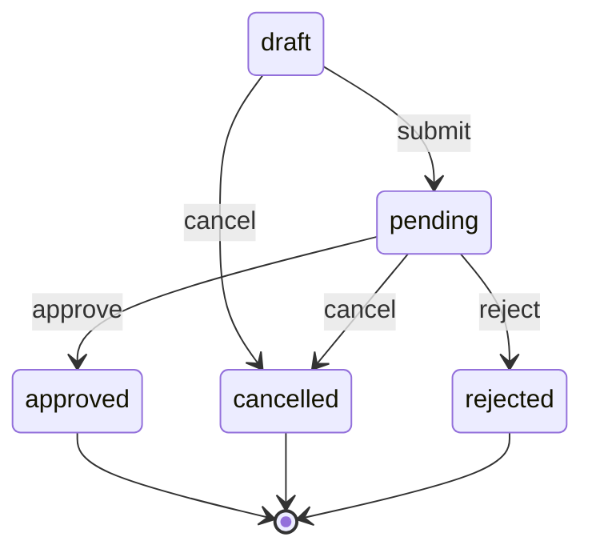

# fsm

A stateless, generic finite state machine for Go.

```
go get github.com/zieksef/fsm
```

## Quick start

```go
const (
    StateDraft     fsm.State = "draft"
    StatePending   fsm.State = "pending"
    StateApproved  fsm.State = "approved"
    StateRejected  fsm.State = "rejected"
    StateCancelled fsm.State = "cancelled"
)

const (
    EventSubmit  fsm.Event = "submit"
    EventApprove fsm.Event = "approve"
    EventReject  fsm.Event = "reject"
    EventCancel  fsm.Event = "cancel"
)

type Claim struct {
    ID     string
    Amount int64
    Status string
}

// Built once at startup; configuration errors fail here.
machine, err := fsm.New[Claim]([]fsm.Transition[Claim]{
    {From: StateDraft, Event: EventSubmit, To: StatePending},
    {From: StatePending, Event: EventApprove, To: StateApproved},
    {From: StatePending, Event: EventReject, To: StateRejected},
    {From: StateDraft, Event: EventCancel, To: StateCancelled},
    {From: StatePending, Event: EventCancel, To: StateCancelled},
})

// handle error ...
```

## Firing events

The machine holds no run state: pass the current state in, persist the
returned one. The returned `State` is always the state after the call — the
target on success, the input unchanged on any error.

```go
next, err := machine.Fire(ctx, fsm.State(claim.Status), EventApprove, claim)
if err != nil {
    return err // state unchanged; match with errors.Is
}
claim.Status = string(next)
```

## Queries

```go
machine.Has(StateDraft, EventSubmit) // true; table lookup only, guards not evaluated
machine.Terminal(StateApproved)      // true; terminal = no outgoing transitions
```

## Callbacks

Guards and actions hang on transitions; enter/exit callbacks are machine-wide
observers. 

Execution order: onExit[A] → onEnter[B] → guard → action → onExit[B] → onEnter[C]. A false guard
or a failed action aborts the transition with the state unchanged; callbacks
cannot alter the outcome.

```go
machine, err := fsm.New[Claim]([]fsm.Transition[Claim]{
    {From: StatePending, Event: EventApprove, To: StateApproved,
        Guard:  func(_ context.Context, c *Claim) bool { return c.Amount > 0 },      // false rejects
        Action: func(ctx context.Context, c *Claim) error { return notify(ctx, c) }, // error aborts
    },
},
    fsm.WithOnEnter[Claim](func(ctx context.Context, e fsm.Event, s fsm.State, c *Claim) {
        slog.InfoContext(ctx, "state entered",
            slog.Any("state", s), slog.Any("event", e), slog.String("claim", c.ID))
    }),
    fsm.WithOnExit[Claim](func(ctx context.Context, e fsm.Event, s fsm.State, c *Claim) {
        slog.InfoContext(ctx, "state left",
            slog.Any("state", s), slog.Any("event", e), slog.String("claim", c.ID))
    }),
)
```

## Self-driving pipelines

`Drive` runs the machine from a starting state to a terminal one. Each
non-terminal state carries a decider that does the state's work and returns
the next event; the transition table still decides where events lead.

```go
machine, err := fsm.New[Claim](transitions, // the quick-start table
    fsm.WithDeciders(map[fsm.State]fsm.Decider[Claim]{
        StateDraft: func(_ context.Context, c *Claim) fsm.Event { return EventSubmit },
        StatePending: func(_ context.Context, c *Claim) fsm.Event {
            if c.Amount < 10_000 {
                return EventApprove
            }
            return EventReject
        },
    }),
)

final, err := machine.Drive(ctx, StateDraft, claim)
// final: StateApproved or StateRejected; err covers machine problems only
// (ctx cancelled, missing decider, unknown event)
```

Ending in `rejected` is a *successful* run — business outcomes are modeled in
the graph, not in the error.

## Visualization

`Mermaid()` emits a Mermaid `stateDiagram-v2` block; `Visualize()` emits
Graphviz DOT. The quick-start graph, as rendered by `machine.Mermaid()`:


